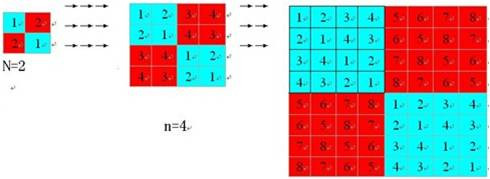

## 使用分治法解决循环日程表问题

> 要求: 安排比赛日程 每个选手与其他每个选手进行一对一比赛， 一天只与一个选手比赛，不重复比赛，不漏掉;

> 例子: 如下图
        

    分治算法的基本思想是将一个规模为N的问题分解为K个规模较小的子问题，
    这些子问题相互独立且与原问题性质相同。求出子问题的解，就可得到原问题的解。
    即一种分目标完成程序算法，简单问题可用二分法完成。

> 分解复杂问题为简单的组合， 如图

        
        #include <stdio.h>
        #include<conio.h>
        #define MAXN 64
        int a[MAXN + 1][MAXN + 1] = {0}; //从1开始
        
        // 分治算法
        
        void gamecal(int k, int n) {//k表示开始的选手编号， n表示选手个数
            int i, j;
            if(n == 2){
                a[k][1] = k; // 参赛选手编号为k
                a[k][2] = k + 1; // 对阵选手编号为k+1
                a[k + 1][1] = k + 1; // 参赛选手编号为k
                a[k + 1][2] = k; // 对阵选手编号为k+1
            }else {
                gamecal(k, n/2);//递归完成左上角
                gamecal(k + n/2, n/2);//递归完成左下角
        
                //右上角，右下角 通过观察发现与左下角和左上角完全一样。可以通过循环求得
                for(i = k; i< k + n/2; i++){//右上角
                    for(j = n/2 + 1; j <= n; j++){
                        a[i][j] = a[i + n/2][j - n/2];
                    }
                }
                for(i = k + n/2; i < k + n; i++){//右下角
                     for(j = n/2 + 1; j <= n; j++){
                        a[i][j] = a[i - n/2][j - n/2];
                    }
                }
        
            }
        }
        
        int main(){
            int m,i,j;
            printf("输入参赛选手人数: ");
            scanf("%d", &m);
            j = 2;
            for(i = 2; i < 8; i++){//判断是否整数次幂
                j = j * 2;
                if(j == m)
                    break;
            }
            if(i >= 8){
                printf("参赛选手人数必须为2的整数次幂， 且不超过64个 \n");
                getch();
                return 0;
            }
            gamecal(1, m);
            printf("\n编号 ");
            for(i = 2; i <= m; i++){
                printf("%2d天", i - 1);
            }
            printf("\n");
            for(i = 1; i <= m; i++){
                for(j = 1; j <= m; j++){
                    printf("%4d", a[i][j]);
                }
                printf("\n");
            }
        
            getch();
            return 0;
        }
