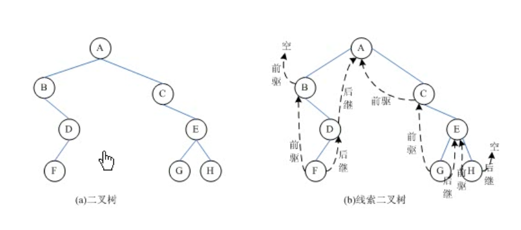

> 线索二叉树：二叉树存储结构完全依靠链表，而二叉树的链表表示的关系是父结点和子结点（子树）的关系，
            而无法直接获得前驱-后继的关系，即，当要求某个结点的前驱结点or后继结点比较麻烦；
            为了在不增加指针的情况下直接快速找到前驱/后继结点，可以使用 线索二叉树 来实现；
    
            


> 由于遍历方法不同时，产生的元素顺序不同，则每个元素的前驱/后继结点也不一定相同，
        所以线索二叉树就由此分为先序线索二叉树，中序线索二叉树和后序线索二叉树；



        上图为 中序线索二叉树，由上图二叉树结构可知，其中序遍历结果为 B F D A C G E H 其中 B、D、F、C等元素拥有空的指针域；
        这些空的指针域可以用来存放前驱或者后继结点的地址，这种指针称为线索（Thread）；
        而为了与存放子树（子树）的指针区分开来，增加了两个标志lflag，rflag表示左/右指针是哪种指针；
        由此可得 线索二叉树 结构为：
        
```c        
typedef char DATA;          //定义树结点的元素类型
typedef enum{
    SubTree,
    Thread
}NodeFlag;                  //定义枚举类型NodeFlag，包含SubTree（表示子树）和Thread（表示线索），分别为 0，1

typedef struct ChainTree{   //定义二叉树结点类型
    DATA data;              //结点数据
    NodeFlag lflag;         //左标志：用来表示左指针是子树指针还是线索指针
    NodeFlag rflag;         //右标志：用来表示右指针是子树指针还是线索指针
    struct ChainTree *left; //左子树结点指针
    struct ChainTree *right;//右子树结点指针
}ChainBinTree;
```

### 线索二叉树实例代码

*本实例是在二叉树代码的基础上增加和修改的 这里只展示新增和修改的部分， 原来的代码见: http://zj2626.github.io/2017/08/27/20170827_ecs/*

> #### BinTree.h

```c
/*
        修改结构体为：
*/

typedef char DATA;          //定义树结点的元素类型
typedef enum{
    SubTree,
    Thread
}NodeFlag;                  //定义枚举类型NodeFlag，包含SubTree（表示子树）和Thread（表示线索），分别为 0，1

typedef struct ChainTree{   //定义二叉树结点类型
    DATA data;              //结点数据
    NodeFlag lflag;         //左标志：用来表示左指针是子树指针还是线索指针
    NodeFlag rflag;         //右标志：用来表示右指针是子树指针还是线索指针
    struct ChainTree *left; //左子树结点指针
    struct ChainTree *right;//右子树结点指针
}ChainBinTree;


/*
        增加的函数
*/

/*二叉树按中序线索化*/
void BinTreeThreading_LDR(ChainBinTree *bt);

/*中序线索二叉树 找到后继结点*/
ChainBinTree *BinTreeNext_LDR(ChainBinTree *bt);

/*中序线索二叉树遍历*/
void ThreadBinTree_LDR(ChainBinTree *bt, void (*oper)(ChainBinTree *p));
```
        
> #### BinTree.c


```c

/*
        增加的函数
*/
        
/********************************线索二叉树***************************/

ChainBinTree *Previous = NULL;//保存前驱结点指针


/*二叉树按中序线索化*/
void BinTreeThreading_LDR(ChainBinTree *bt){
    if(bt){//判断结点非空
        //左子树操作
        BinTreeThreading_LDR(bt->left);             //递归调用，线索化左子树

        //当前结点操作
        bt->lflag = (bt->left) ? SubTree : Thread;  //设置左指针域标志
        bt->rflag = (bt->right) ? SubTree : Thread; //设置右指针域标志
        if(Previous){                               //判断前驱结点是否存在（就第一个没有前驱）
            if(Previous->rflag == Thread)           //判断起前驱结点的右标志是否为线索，如果不是，则说明该前驱结点存在右子树
                Previous->right = bt;               //设置前驱结点的右线索指向后继结点（当前）
            if(bt->lflag == Thread)                 //判断当前结点的左标志是否为线索，如果不是，则说明当前结点存在左子树
                bt->left = Previous;                //设置当前结点的左线索指向前驱结点
        }
        Previous = bt;//保存刚访问的结点到Previous，作为下一个结点的前驱结点

        //右子树操作
        BinTreeThreading_LDR(bt->right);//递归调用，线索化右子树
    }
}

/*中序线索二叉树 找到后继结点*/
ChainBinTree *BinTreeNext_LDR(ChainBinTree *bt){
    ChainBinTree *nextNode;                 //存放后继结点
    if(!bt)
        return NULL;

    if(bt->rflag == Thread){                //判断当前结点右标志是否为线索，如果是则说明right存放的是后继结点的地址，直接返回
        return bt->right;
    }else{
        nextNode = bt->right;               //暂时存放当前结点的右子树的根节点
        while(nextNode->lflag == SubTree){  //循环获取右子树的“最左结点”，这就是要求的后继结点
            nextNode = nextNode->left;
        }
        return nextNode;
    }
}

/*中序线索二叉树遍历*/
void ThreadBinTree_LDR(ChainBinTree *bt, void (*oper)(ChainBinTree *p)){
    if(bt){
        while(bt->lflag == SubTree){    //循环找到第一个中序遍历的结点
            bt = bt->left;
        }

        do{
            oper(bt);
            bt = BinTreeNext_LDR(bt);   //获取后继结点，把地址赋值给bt
        }while(bt);
    }
}
```
        
> #### main.c

```cpp
        /*
                    修改的main函数为：
        */

        int main()
        {
            ChainBinTree *root = NULL;          //root为指向二叉树根节点的指针
            char select;
            void (*oper1)();                    //指向函数的指针
            oper1 = oper;                       //指向具体操作的函数
            do{
                printf("\n1.设置二叉树根元素 2.添加二叉树结点  3.先序  4.中序  5.后序  6.按层  7.二叉树深度  8.生成中序线索二叉树  9.遍历中序线索二叉树  0.退出");
                select = getch();
                switch(select){
                    case '1':
                        root = initRoot();
                        break;
                    case '2':
                        addNode(root);
                        break;
                    case '3':
                        binTree_DLR(root, oper1);
                        printf("\n");
                        break;
                    case '4':
                        binTree_LDR(root, oper1);
                        printf("\n");
                        break;
                    case '5':
                        binTree_LRD(root, oper1);
                        printf("\n");
                        break;
                    case '6':
                        binTree_Level(root, oper1);
                        printf("\n");
                        break;
                    case '7':
                        printf("%d", binTreeDepth(root));
                        break;
                    case '8':
                        BinTreeThreading_LDR(root);
                        break;
                    case '9':
                        ThreadBinTree_LDR(root, oper1);
                        break;
                }
            }while(select != '0');
        
            binTreeClear(root);
            root = NULL;
        
            return 0;
        }
```

> 个人博客 欢迎来访： http://zj2626.github.io