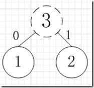
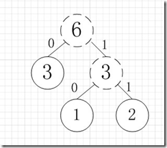
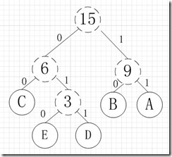

> 哈夫曼树：又称最优二叉树，是一种带权路径长度最短的二叉树；
> 哈夫曼编码：哈夫曼树的一个应用，如JPEG中就应用；
        
        所谓树的带权路径长度，就是树中所有的叶结点的权值乘上其到根结点的路径长度
        （若根结点为0层，叶结点到根结点的路径长度为叶结点的层数）。
        树的带权路径长度记为WPL = (W1*L1+W2*L2+W3*L3+...+Wn*Ln)，
        N个权值Wi(i=1,2,...n)构成一棵有N个叶结点的二叉树，相应的叶结点的路径长度为Li(i=1,2,...n)。
        可以证明哈夫曼树的WPL是最小的。
        
        一般权值用来表示频率大小，频率越大则权值越高
        
        


> 参考博客1： http://www.cnblogs.com/junyuhuang/p/4127095.html

> 参考博客2： http://www.cnblogs.com/Jezze/archive/2011/12/23/2299884.html


> ####哈弗曼编码原理(转载)

        　　哈夫曼编码使用一种特别的方法为信号源中的每个符号设定二进制码。出现频率更大的符号将获得更短的比特，出现频率更小的符号将被分配更长的比特，以此来提高数据压缩率，提高传输效率。具体编码步骤主要为，
        
        　　1、统计：
        
        　　在开始编码时，通常都需要对信号源，也就是本文的一段文字，进行处理，计算出每个符号出现的频率，得到信号源的基本情况。接下来就是对统计信息进行处理了
        
        　　
        
        　　2、构造优先对列：
        
        　　把得到的符号添加到优先队列中，此优先队列的进出逻辑是频率低的先出，因此在设计优先队列时需要如此设计，如果不熟悉优先队列，请阅读相关书籍，在此不做过多概述。得到包含所有字符的优先队列后，就是处理优先队列中的数据了。
        
        
        　　3、构造哈夫曼树：
        
        　　哈夫曼树是带权值得二叉树，我们使用的哈夫曼树的权值自然就是符号的频率了，我们构建哈夫曼树是自底向上的，先构建叶子节点，然后逐步向上，最终完成整颗树。先把队列中的一个符号出列，也就是最小频率的符号，，然后再出列一个符号。这两个符号将作为哈夫曼树的节点，而且这两个节点将作为新节点，也就是它们父节点，的左右孩子节点。新节点的频率，即权值，为孩子节点的和。把这个新节点添加到队列中(队列会重新根据权值排序)。重复上面的步骤，两个符号出列，构造新的父节点，入列……直到队列最后只剩下一个节点，这个节点也就是哈夫曼树的根节点了。
        
        　　
        
        　　4、为哈弗曼树编码：
        
        　　哈夫曼树的来自信号源的符号都是叶子节点，需要知道下。树的根节点分配比特0，左子树分配0，右字数分配1。然后就可以得到符号的码值了。
        
         

> ####哈夫曼编码步骤 

1.首先构建一个元素为哈夫曼树结点的数组用于存储哈夫曼树（线性）；
        
        哈夫曼树数据结构包括元素数据、权值、父结点位置（数组下标）、两个子结点位置
        
        typedef struct
        {
            int weight;
            int parent;
            int lchild;
            int rchild;
            int value;
        } HNodeType

2.初始化数组，设置树元素的默认属性；然后输入要编码的数据及其权值，存储到数组前几位，这几个即为哈夫曼树的叶子结点；
        
        哈夫曼树中有效的数据仅仅是叶子结点，
        而非叶子结点是为了构建哈夫曼树而加入的

3.开始构建哈夫曼树：找出整个数组中有数据且权值最低的两个作为新构造的二叉树的左右子树，新二叉树的根结点的权值为其左右子树的根结点的权值之和；
    然后把新构建的根结点存放到数中空位置，然后继续从整个数组中寻找。。。直到有效元素全部读取。

4.编码,树的根节点分配比特0，左子树分配0，右字数分配1;

5.解码,思路就是 把要解码的字符串像学中学方程一样代入到哈夫曼树中，按照左子树分配0，右字数分配1的原则，一个一个遍历出来

---
---

        示例(转载)：
        
    　　假如我有A,B,C,D,E五个字符，出现的频率（即权值）分别为5,4,3,2,1,
        那么我们第一步先取两个最小权值作为左右子树构造一个新树，即取1，2构成新树，其结点为1+2=3，如图：
        
　　
    
    　  虚线为新生成的结点，第二步再把新生成的权值为3的结点放到剩下的集合中，所以集合变成{5,4,3,3}，再根据第二步，取最小的两个权值构成新树，如图：
    
　　
    
        再依次建立哈夫曼树，如下图：
    
　　
    
        其中各个权值替换对应的字符即为下图：
        
　　

        如下图也可以加深大家的理解：

　　

---
---

> 代码实例

```c
/*-------------------------------------------------------------------------
 * Name:   哈夫曼编码源代码。
 * Date:   2011.04.16
 * Author: Jeffrey Hill+Jezze(解码部分)
 * 在 Win-TC 下测试通过
 * 实现过程：着先通过 HuffmanTree() 函数构造哈夫曼树，然后在主函数 main()中
 *           自底向上开始(也就是从数组序号为零的结点开始)向上层层判断，若在
 *           父结点左侧，则置码为 0,若在右侧,则置码为 1。最后输出生成的编码。
 *------------------------------------------------------------------------*/


//结点个数 = 叶子结点个数 * 2 - 1
#include <stdio.h>
#include<stdlib.h>

#define MAXBIT      100
#define MAXVALUE  10000
#define MAXLEAF     30
#define MAXNODE    MAXLEAF*2 -1

typedef struct
{
    int bit[MAXBIT];    //结点的编码
    int start;          //结点编码的起始位，有效位置，如当start=2， 则该结点的编码从bit[2]开始
} HCodeType;        /* 编码结构体 */

typedef struct
{
    int weight;
    int parent;
    int lchild;
    int rchild;
    int value;
} HNodeType;        /* 结点结构体 */

/* 构造一颗哈夫曼树 */
void HuffmanTree(HNodeType HuffNode[MAXNODE],  int n)
{
    /*  i、j： 循环变量，
        m1、m2：构造哈夫曼树不同过程中两个最小权值结点的权值，
        x1、x2：构造哈夫曼树不同过程中两个最小权值结点在数组中的序号。*/
    int i, j, m1, m2, x1, x2;
    /* 初始化存放哈夫曼树数组 HuffNode[] 中的结点 */
    for(i = 0; i < 2 * n - 1; i++)
    {
        HuffNode[i].weight = 0;//权值
        HuffNode[i].parent = -1;//父结点位置初始化为-1，表示没有父结点，到时候要通过该属性进行判断，排除掉已加入到树的元素
        HuffNode[i].lchild = -1;//初始化左子树根节点位置
        HuffNode[i].rchild = -1;//初始化右子树根节点位置
        HuffNode[i].value = i;  //实际值，可根据情况替换为字母
    } /* end for */

    /* 用户输入 n 个叶子结点的权值 */
    for(i = 0; i < n; i++)
    {
        printf("请输入第 %d 个元素的权值: \n", i);
        scanf("%d", &HuffNode[i].weight);
    } /* end for */

    /* 循环构造 Huffman 树 */
    for(i = 0; i < n - 1; i++)      // 循环叶子结点的个数，一次循环要形成一个“新”的二叉树
    {
        m1 = m2 = MAXVALUE;         //m1、m2中存放两个无父结点且结点权值最小的两个结点
        x1 = x2 = 0;
        //找出所有结点中权值最小、无父结点的两个结点，并合并之为一颗二叉树
        for(j = 0; j < n + i; j++)  //循环数组中元素个数
        {
            //要找到当前数组中所有的元素中最小的两位，处理之后又把结果存到数组中所以要(n+i)
            if(HuffNode[j].weight < m1 && HuffNode[j].parent == -1)
            {
                //当前的权值更小，把当前元素赋值给m1，把原来m1的赋值给m2
                m2 = m1;
                x2 = x1;
                m1 = HuffNode[j].weight;
                x1 = j;
            }
            else if(HuffNode[j].weight < m2 && HuffNode[j].parent == -1)
            {
                //当前的权值大于m1但是小于m2，把其赋值给m2
                m2 = HuffNode[j].weight;
                x2 = j;
            }
        } /* end for */
        /* 最终，m1每次存放最小权值，m2存放次小的 */

        /* 设置 找到的两个子结点 x1、x2 的父结点信息 */
        /* 父结点存放到数组的下标为(n + i)的位置 */
        HuffNode[x1].parent  = n + i;
        HuffNode[x2].parent  = n + i;
        /* 设置 父结点的属性 */
        HuffNode[n + i].weight = HuffNode[x1].weight + HuffNode[x2].weight;
        HuffNode[n + i].lchild = x1;
        HuffNode[n + i].rchild = x2;

        printf("第 %d 次循环的两个结果的权值为: %d, %d\n", i + 1, HuffNode[x1].weight, HuffNode[x2].weight); /* 用于测试 */
        printf("\n");
    } /* end for */
    /*  for(i=0;i<n+2;i++)
        {
            printf(" Parents:%d,lchild:%d,rchild:%d,value:%d,weight:%d\n",HuffNode[i].parent,HuffNode[i].lchild,HuffNode[i].rchild,HuffNode[i].value,HuffNode[i].weight);
        }*///测试
} /* end HuffmanTree */

//解码
void decodeing(char string[], HNodeType Buf[], int Num)
{
    //tmp：循环中临时存放哈夫曼树数组的元素下标，从大到小
    int i, tmp = 0, code[1024];
    int m = 2 * Num - 1;
    char *nump;
    char num[1024];
    int len = strlen(string);

    for(i = 0; i < len; i++)
    {
        if(string[i] == '0')
            num[i] = 0;
        else
            num[i] = 1;
    }
    i = 0;
    nump = &num[0];//nump指向要解码的字符数组的第一个元素的地址

    printf(" 解码结果为： ");
    while(nump < (&num[len]))//循环遍历要解码的字符数组（即输入的解码前字符串），直到最后一个数组元素
    {
        tmp = m - 1;//每次循环设置初始元素下标，设置为 哈夫曼树数组 的最后一个有效数据元素的下标（树的根节点）
        while((Buf[tmp].lchild != -1) && (Buf[tmp].rchild != -1))//循环判断该元素有没有子结点，直到没有子结点，则说明遍历到叶子结点，则说明找到一个解码的结果
        {
            if(*nump == 0)  //判断要解码的字符数组的当前元素是否为0 0表示左结点 1表示有结点
            {
                tmp = Buf[tmp].lchild ;
            }
            else
            {
                tmp = Buf[tmp].rchild;
            }
            nump++;                     //数组元素是字符，每个元素只占一个字节，所以++也就是地址加一，指向数组下一个元素
        }

        printf(" %d", nump, &num[strlen(string)], Buf[tmp].value);
    }
}


int main(void)
{

    HNodeType HuffNode[MAXNODE];            /* 定义一个结点结构体数组 */
    HCodeType HuffCode[MAXLEAF],  cd;       /* 定义一个编码结构体数组， 同时定义一个临时变量来存放求解编码时的信息(即cd.bit存放当前结点的编码的倒序，cd.start存放结点编码开始位置) */
    /*
        i、j： 循环变量，
        c 循环体中当前的结点在数组中的下标
        p 当前结点的父结点在数组中的下标
        n 有效数据的个数（叶子结点的个数）
    */
    int i, j, c, p, n;
    char pp[100];
    printf("Please input n:\n");
    scanf("%d", &n);
    HuffmanTree(HuffNode, n);//生成哈夫曼树

    /*对哈夫曼树进行编码*/
    for(i = 0; i < n; i++)//循环所有的有效数据，一个一个进行编码 (0 ~ n-1)
    {
        cd.start = n - 1;       //
        c = i;                  //c 当前结点在数组中的下标 整体上来说可以表示循环在“树”中走过的结点下标
        p = HuffNode[c].parent; //p 当前结点的父结点在数组中的下标
        while(p != -1)    /* 判断父结点存在 */
        {
            if(HuffNode[p].lchild == c) //判断当前结点是不是父结点的左子树根节点 如果是的话就 赋值0
                cd.bit[cd.start] = 0;
            else                        //如果不是的话就 赋值1 >>>> 因为“左子树分配0，右字数分配1”
                cd.bit[cd.start] = 1;
            cd.start--;        /* 求编码的低一位 */

            /* 设置下一循环条件 */
            c = p;                  //设置c为父结点的下标 准备进行下次while循环，则那时候的“当前的结点”就会变成现在结点的父结点
            p = HuffNode[c].parent; //同理

        }/* end while */

        /* 保存 求出的每个叶结点的哈夫曼编码和编码的起始位 */
        for(j = cd.start + 1; j < n; j++)
        {
            HuffCode[i].bit[j] = cd.bit[j];
        }
        HuffCode[i].start = cd.start + 1;   //编码的起始位

    } /* end for */
    /*对哈夫曼树进行编码结束*/

    /* 打印已保存好的所有存在编码的哈夫曼编码 */
    for(i = 0; i < n; i++)
    {
        printf("第%d位置的树结点的编码为：: ", i);
        for(j = HuffCode[i].start; j < n; j++)//从有效位置开始输出该结点的编码
        {
            printf("%d", HuffCode[i].bit[j]);
        }
        printf(" 结点的属性bit数组中有效的编码开始位置为:bit[%d]\n", HuffCode[i].start);
    }
    /* 打印结束 */

    printf("Decoding?Please Enter code:\n");
    scanf("%s", &pp);
    decodeing(pp, HuffNode, n);
    getch();
    return 0;
}


```

> 个人博客 欢迎来访： http://zj2626.github.io