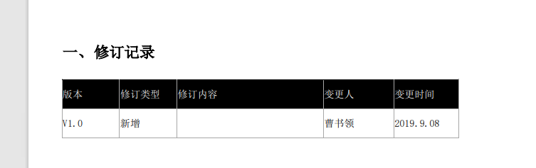

## 1. 溢出

虚拟机规范中, 除了程序计数器, 其他部分都可能发生OOM异常

## 2.溢出种类

> java堆存储对象实例, 只需不断创建对象且GC Roots到对象可达避免垃圾回收, 达到最大堆限制即溢出

```java

```


### 1.Java堆溢出



```java
/**
 *  vm args: -Xms20m -Xmx20m -XX:+HeapDumpOnOutOfMemoryError -XX:+PrintGCDetails
 *  @see com.demo.common.service.jvm.oom.HeapOOM
 */
    
//      Exception in thread "main" java.lang.OutOfMemoryError: Java heap space
```

### 2.虚拟机栈和本地方法栈溢出

```java
/**
 * vm args: -Xss128k -XX:+PrintGCDetails
 * @see com.demo.common.service.jvm.oom.StackOOM
 */

//    Exception in thread "main" java.lang.StackOverflowError
```

### 3.方法去和运行时常量池溢出

```java

```
### 4.本机直接内存溢出


 

