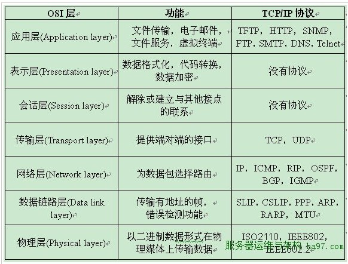

        

　　

　　

  

> ISO: (International Organization for Standards) 国际标准化组织

> OSI(参考模型): (Open Systems Interconnection) 开放式通信系统互联网参考模型：把通信功能划分为7个分层

> OSI协议: OSI协议以OSI参考模型为基础界定了每个阶层的协议和每个阶层之间接口相关的标准；遵循OSI协议的的产品为OSI产品；

> MAC地址: (Media Access Control)介质访问控制；也叫物理地址、硬件地址；

> Unicast: 单播；Broadcast: 广播；Multicast: 多播；Anycast: 任播

> 网卡: NIC(Network Interface Card)，使计算机联网的设备

> 中继器: (Repeater) ，物理层上延长网络的设备(处于第一层)
        
        由电缆传过来的电信号或光信号经由中继器的波形调整和放大再传给另一个电缆

> 网桥: (Bridge) 也叫2层交换机，从数据链路层上延长网络的设备(处于第二层)，根据MAC地址进行处理

        能识别数据帧，并把数据帧临时存储于内存，并重新生成信号作为新的帧转发给相连的另一个网段
        
        地址自学机制 地址过滤功能

> 路由器: (Router) 也叫3层交换机，通过网络层转发分组数据的设备(处于第三层)，根据IP地址处理

> 4~7层交换机：处理传输层以上各层网络传输的设备

> 网关: (Gateway) 转换协议的设备，协议转换，数据转发(从传输层到应用层的数据转换、转发)

> FCS: (Frame Check Sequence) 帧检验序列，(网桥)校验数据是否正确的送达目的地

> CRC: (Cyclic Redundancy Check) 循环冗余校验码，CRC循环冗余码校验FCS帧检验序列

> ATM: (Asynchronous Transfer Mode) 异步传输

> 网络协议族: (Internet Protocol Suite) 组成网际协议的一组协议

> IETF: (The Internet Engineering Task Force) 国际互联网工程任务组，一个公开性质的大型民间国际团体

> RFC: (Request For Comment) 记录TCP/IP协议及其实现和运用信息

> 互联网: (The Internet) 

> NOC: (Network Operation Center) 网络操作中心，互联网中每个网络由NOC相连 

> IX: (Internet Exchange) 网络交换中心，连接异构网络(不同运营商导致)需要IX支持

> ISP: (Internet Service Provider) 互联网服务提供商

> IP: (Internet Protocol)跨越网络传送数据包(分组交换)

> ICMP: (Internet Control Message Protocol) Internet控制报文协议，

        当IP数据包发送途中发生异常无法达到目的地址，需要给发送端发送一个异常的通知(可以诊断网络健康状况)

> ARP: (Address Resolution Protocol)从分组数据包的IP地址中解析出物理地址(MAC地址)的一种协议

> TCP: (Transmission Control Protocol)  传输控制协议，面向有连接，传输层协议，

> UDP: (User Datagram Protocol) 用户数据报协议，面向无连接，传输层协议，

> WWW: (World Wide Web) 

> HTTP: (HyperText Transfer Protocol) 超文本传输协议 

> SMTP: (Simple Mail Transfer Protocol)  

> MIME: () (表示层协议)

> FTP: (File Transfer Protocol) 文件传输协议

> TELNET: 网络远程登陆协议 

> SSH: (Secure Shell)   

> SNMP: (Simple Network Management Protocol) 简单网络管理协议 (应用层协议)

        在TCP/IP中进行网络管理， 采用SNMP管理的主机、网桥、路由器称为SNMP代理(Agent)，进行管理的那一段叫做管理器(Manager)
        Agent和Manager用到该协议
        在SNMP代理端，保存网络接口的信息、通信数据量、异常数据量等信息
        可以及时检查网络拥堵情况

> MIB: () (表示层协议)

> CSMA: (Carrier Sense Multiple Access) 载波侦听多路访问，争夺获取数据传输的权力

> CSMA/CD: 相对于CSMA，要求每个站提前检测冲突，发生冲突，则尽早释放信道

> FDDI: (Fiber Distributed Data Interface) 光纤分布式数据接口

> BPDU: (Bridge Protocol Data Unit) 生成树方式中，每个网桥必须在每1-10秒内小胡交换BPDU包，用来判断哪些端口使用哪些不使用，以便消除环路

> RSTP: (Rapid Spanning Tree Protocol) 能将发生环路时的恢复时间缩短到几秒之内 

> 无线PAN: (Personal Area Network) 通信距离10米左右，应用：蓝牙

> 无线LAN: (Local Area Network) 通信距离100米左右，应用：Wi-Fi

> 无线MAN: (Metropolitan Area Network) 通信距离1km-100km，应用：WiMAX

> 无线RAN: (Regional Area Network) 通信距离200k-700km

> 无线WAN: (Wide Area Network) 应用3G,LTE,4G等

> PPP: (Point to Point Protocol) 点对点协议，相当于2层的数据链路层

        ppp协议的主要功能中主要包括两个协议：
        
            1.LCP：(Link Control Protocol)，不依赖上层，
                
                通过两次握手进行用户名密码验证，明文传输密码，不安全
                
                主要负责建立和断开连接，设置最大接受单元（MRU，Maximum Receive Unit），
                设置验证协议[PAP(Password Authentication Protocol) 或 CHAP(Challenge Handshake Authentication Protocol)]，
                设置进行通信质量监控与否
            
            2.NCP: (Network Control Protocol)， 
                
                依赖上层，如果上层是IP，则此时NCP也叫IPCP
                
                使用一次性密码OTP(One Time Password)， 安全，防止窃听
                
                IPCP主要IP地址设置以及是否进行TCP/IP首部压缩等设置
                
            
            ppp协议连接时，需要进行用户名密码验证
            
> PPPoE: (PPP over Ethernet) 互联网接入服务商在以太网上提供PPP功能，可以提供计费功能

> ADSL: (Asymmetric Digital Subscriber Line) 非对称数字用户环路

> FTTH: (Fiber To The Home) 光纤到户

> VPN: (Virtual Private Network) 虚拟专用网络

> MTU: (Maximum Transmission Unit)  最大传输单元

> CIDR: (Classless Inter-Domain Routing) 无类型域间选路

> CIDR: (Border Gateway Protocol) 边界网关协议

> VLSM: (Variable Length Subnet Mask) 可变长子网掩码

> ICANN: (Internet Corporation for Assigned Names and Numbers) 互联网名称与数字地址分配机构

> NAT: (Network Address Translation) 网络地址转换

----
----

> 个人博客 欢迎来访： http://zj2626.github.io